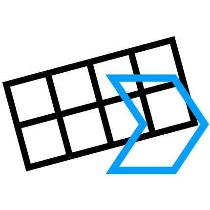

# RPG Maker Faces Generator (RMFG)

Quick and easy way to merge multiple image files into a 576x288 grid to use as Faces images for RPG Maker.

Supply the source directory, output directory, extension to use (without the .).

Optional, but you can also supply a prefix to use and tick a box if the images are numbered.

(Yes I'm aware I called it RPGMakerActorGenerator by mistake)
